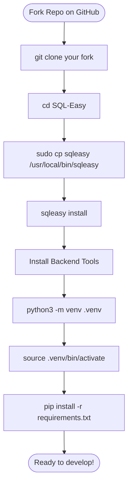
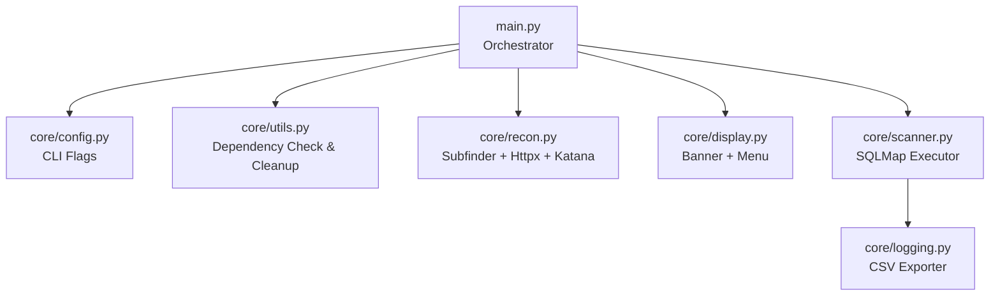
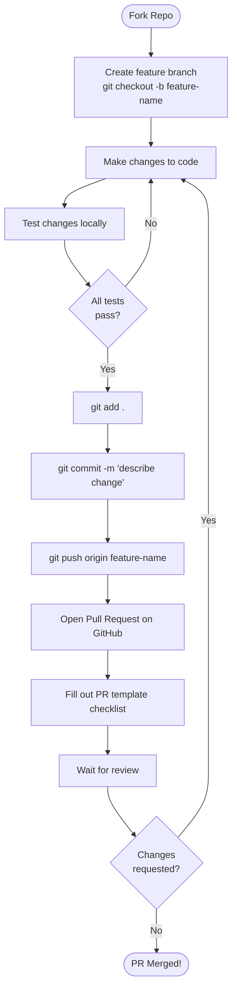
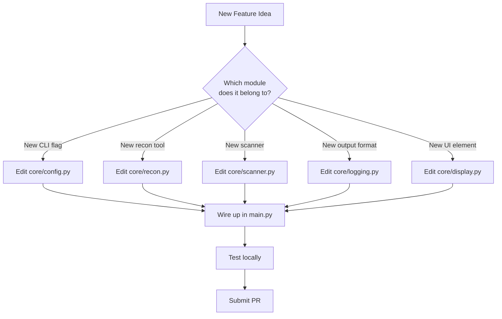

# Contributing to SQL Easy

Thank you for considering contributing to SQL Easy! Every contribution makes this tool better for the entire security research community.

---

## Table of Contents

- [Who Should Contribute](#who-should-contribute)
- [Development Environment Setup](#development-environment-setup)
- [Understanding the Codebase](#understanding-the-codebase)
- [Module Architecture](#module-architecture)
- [Module Dependency Graph](#module-dependency-graph)
- [Code Style Guidelines](#code-style-guidelines)
- [Submitting a Pull Request](#submitting-a-pull-request)
- [Adding New Features](#adding-new-features)
- [Testing Your Changes](#testing-your-changes)

---

## Who Should Contribute

- Security researchers who want to add new scanners or tools
- Python developers who want to improve the core pipeline
- Bug hunters who found a bug and want to patch it
- Documentation writers who want to improve clarity

---

## Development Environment Setup

### Step 1: Fork and Clone

Fork the repository on GitHub, then clone your fork:

```bash
git clone https://github.com/syed-sameer-ul-hassan/SQL-Easy.git
cd SQL-Easy
```

### Step 2: Install and Configure Global Launcher

Make the `sqleasy` command available globally across your system:

```bash
sudo cp sqleasy /usr/local/bin/sqleasy
sudo chmod +x /usr/local/bin/sqleasy
sqleasy install
```

This will automatically create a configuration directory at `~/.config/sqleasy` to save the dynamic project path and prompt you to install backend dependencies (`sqlmap`, `subfinder`, `httpx`, and `katana`).

### Step 3: Create a Virtual Environment (Optional)

If you are developing or testing Python packages locally:

```bash
python3 -m venv .venv
source .venv/bin/activate
pip install -r requirements.txt
```

### Setup Flow



---

## Understanding the Codebase

Before making any changes, it is critical to understand which module does what. Every feature maps to a specific file.



---

## Module Architecture

### `main.py` — The Orchestrator

This file is the entry point. It imports all `core/` modules and calls them in sequence. It also wraps the entire execution in a global `try...except KeyboardInterrupt` block to ensure safe cleanup when the user presses `Ctrl+C`.

**Rule:** Do not add business logic here. Only orchestration calls.

### `core/config.py` — CLI Arguments

Contains all `argparse` definitions.

**When to edit:** If you want to add a new command-line flag (e.g., `--output`, `--timeout`).

```python
parser.add_argument('-d', '--domain', help='Target domain')
parser.add_argument('-t', '--threads', default=10, type=int)
parser.add_argument('--proxy', help='Proxy URL')
parser.add_argument('--delay', default=0, type=int)
```

### `core/utils.py` — Utilities

Contains two functions:
- `check_dependencies()` — Verifies all 4 tools are in PATH
- `cleanup()` — Deletes `.subs.txt`, `.live_subs.txt`, `.targets.txt`

**When to edit:** If you add a new required tool to the pipeline.

### `core/recon.py` — Reconnaissance Engine

The most complex module. Runs the Subfinder → Httpx → Katana pipeline and applies the Regex priority sort.

**When to edit:** If you want to change how subdomains are discovered, how live hosts are probed, or how URLs are filtered and sorted.

### `core/scanner.py` — SQLMap Executor

Builds the SQLMap command from user input and the `args` config object, then executes it.

**When to edit:** If you want to add new SQLMap flags, change default scan parameters, or add a new scanner tool alongside SQLMap.

### `core/display.py` — UI Engine

Renders the ASCII banner and the Wifite-style numbered target menu.

**When to edit:** If you want to change the visual layout or menu format.

### `core/logging.py` — CSV Exporter

Parses SQLMap output directory logs and writes confirmed vulnerabilities to a CSV file.

**When to edit:** If you want to add more fields to the CSV or support a different output format (e.g., JSON).

---

## Code Style Guidelines

These rules are strictly enforced in all pull requests.

### Rule 1: Never use `shell=True`

```python
subprocess.run(shlex.split("sqlmap -u " + url), check=False)
```

**Never do this:**
```python
subprocess.run("sqlmap -u " + url, shell=True)
```

Using `shell=True` opens the door to OS-level command injection attacks if a user passes a malicious domain name containing shell metacharacters.

### Rule 2: Always wrap File I/O in try/except

```python
try:
    with open('.subs.txt', 'r', encoding='utf-8') as f:
        data = f.read()
except FileNotFoundError:
    print("[-] File not found")
except Exception as e:
    print(f"[-] Error: {e}")
```

### Rule 3: No comments in source code

The codebase is intentionally comment-free. Code should be self-explanatory through clear variable and function naming.

### Rule 4: No unused imports

Every import must be actively used in the file it appears in.

### Rule 5: Use f-strings for string formatting

```python
print(f"{G}[+] Found: {url}{W}")
```

Not: `print("[+] Found: " + url)`

---

## Submitting a Pull Request

### Branch Naming Convention

```
feature/add-nuclei-scanner
fix/katana-crash-on-empty-output
docs/update-readme-diagrams
```

### Step-by-Step PR Flow



### PR Checklist

Before submitting, confirm:
- [ ] Code uses secure list arguments for subprocess calls — no `shell=True` and no `shlex.split` string parsing
- [ ] All file I/O wrapped in `try...except`
- [ ] No comments left in code files
- [ ] No unused imports
- [ ] Tested against a real domain (or a controlled test environment)
- [ ] PR template is fully filled out

---

## Adding New Features

### How to Add a New CLI Flag

1. Open `core/config.py`
2. Add your argument to the `argparse` parser
3. Pass `args` into the relevant function in `main.py`
4. Use `args.your_flag` inside the target module

```python
parser.add_argument('--timeout', default=30, type=int, help='Request timeout in seconds')
```

### How to Add a New Scanner Tool

1. Add the tool name to `REQUIRED_TOOLS` list in `core/utils.py`
2. Add a new function in `core/recon.py` (or a new file `core/your_scanner.py`)
3. Call it from `main.py` after the existing pipeline

### Feature Integration Flow



---

## Testing Your Changes

There is no automated test suite yet. Test manually by running against a controlled target.

### Safe Testing Targets

Use these intentionally vulnerable test sites (legal to test against):

| Site | URL |
|---|---|
| DVWA | `http://localhost/dvwa` (local) |
| WebGoat | `http://localhost:8080/WebGoat` (local) |
| HackTheBox | Machines in your active session |
| TryHackMe | Machines in your active session |

### Quick Sanity Test

```bash
sqleasy start -d sameer.orildo.online
```

If all modules run without Python errors (even if no vulnerabilities are found), your changes are safe to submit.

---

## Questions?

Open a GitHub Discussion or file an Issue using the appropriate template. We respond to all contributions promptly.
