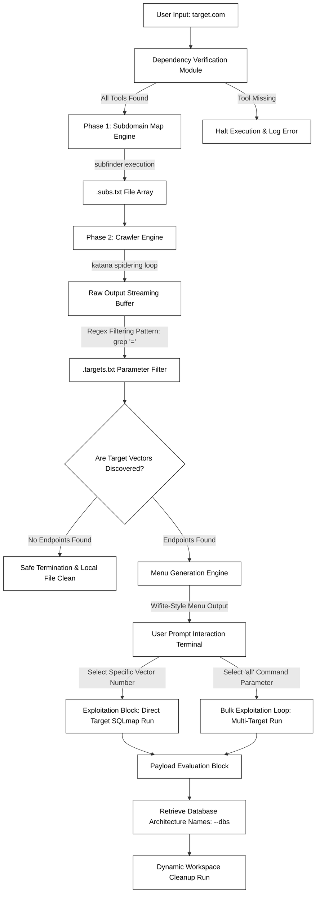

<p align="center">

</p>

<h1 align="center">SQL Easy</h1>

<p align="center">
  High-Volume SQL Injection Automation Funnel
</p>

---

# SQLeasy: High-Volume SQL Injection Automation Funnel

SQL Easy abstracts the structural complexities of managing mass web vulnerability reconnaissance infrastructure. It acts as an orchestrating pipeline wrapper that links passive subdomain mapping utilities with hyper-fast spidering engines and heavy automated database validation frameworks. 

By translating raw network output arrays into a real time interactive command line target layout matrix

---

# 1. Core Architecture Diagram

The execution layout below defines how user inputs are safely parsed, isolated, filtered, and escalated throughout the runtime engine environment.



---

# 2. Granular Step-by-Step Technical Breakdown

## Module A: Dependency Pre-Flight Verification

The system evaluates the host framework PATH variables using binary path verification tools. By testing the availability of three foundational applications (`subfinder`, `katana`, and `sqlmap`), the pipeline blocks broken script runs before wasting local computing or network resources.

---

## Module B: Passive Subdomain Enumeration

When a target domain profile is passed to the input handler, SQLeasy runs `subfinder`. This query framework taps into open-source internet directories (OSINT) to collect all alternative web records associated with the root parent boundary.

The results are instantly stored inside an unformatted storage matrix file:

```bash
.subs.txt
```

---

## Module C: Parameter Extraction and Link Filtering

Direct SQL injection attempts require active entry parameter fields such as query inputs, session variables, or page IDs.

Passing raw domains into an exploitation engine directly creates massive network overhead. SQLeasy forces the collected subdomain array into `katana`, a specialized headless crawling tool.

The output is dynamically piped into a string search filter:

```bash
grep '='
```

This isolates only hyperlinked addresses carrying active data variables, which are then routed into the target profile list:

```bash
.targets.txt
```

---

## Module D: Interactive Menu Generation Matrix

The menu system reads the target file and strips duplicates to build a unique array index capped at 30 items for console readability.

This index directly maps numeric menu identifiers to complex target URLs.

---

## Module E: Automation Hand-Off Execution

When the operator selects an attack sequence number, SQLeasy constructs the command-line call for the underlying scanner engine, injecting automated parameters optimized for controlled testing.

### SQLmap Runtime Parameters

#### `--batch`

Suppresses interactive prompts by automatically selecting default answers for smoother automated execution.

#### `--random-agent`

Spoofs standard browser user-agents to reduce trivial firewall signature detection.

#### `--level=1`

Keeps payload depth lightweight to minimize excessive network traffic.

#### `--risk=1`

Limits aggressive payload behavior to reduce accidental service instability.

---

# 3. Deployment and Local Environment Integration

## System Dependencies

Install the required utilities on Debian/Kali systems:

```bash
sudo apt update && sudo apt install subfinder katana sqlmap -y
```

---

## Global Binary Compilation

Compile SQL Easy into the system execution path:

```bash
chmod +x sql-easy
sudo cp sqleasy /usr/local/bin/sqleasy
```

---

## Running the Tool

```bash
sqleasy
```

---

# 4. Recommended Project Structure

```bash
sql-easy/
├── assets/
│   └── logo.svg
├── README.md
├── LICENSE
└── main.py
```

---

