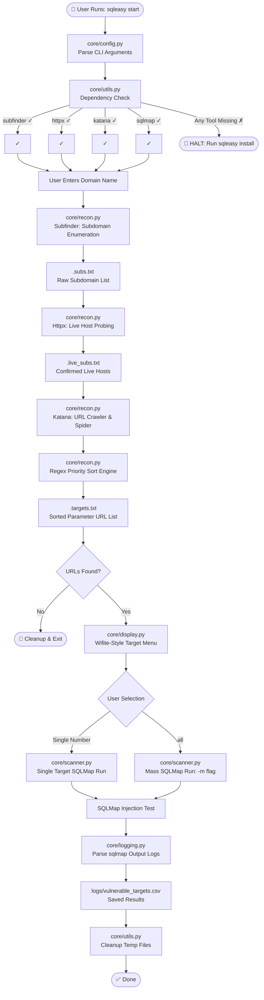
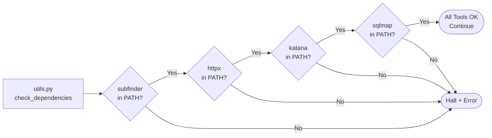
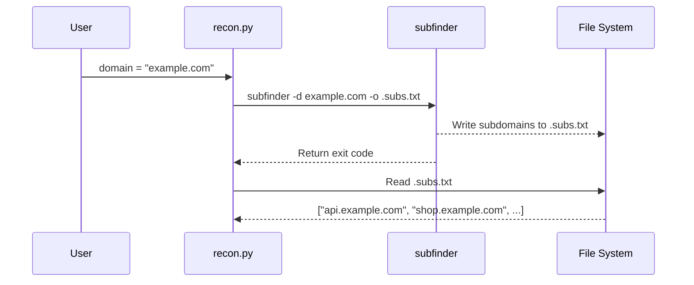
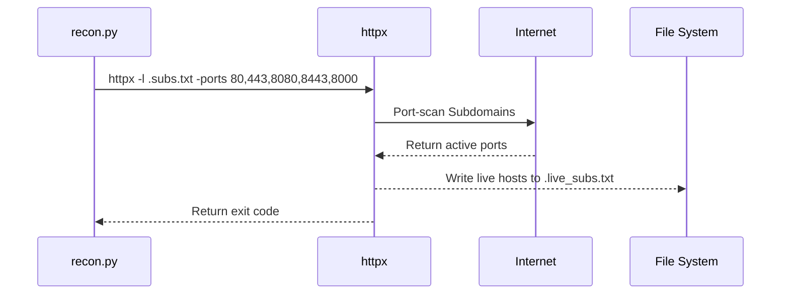
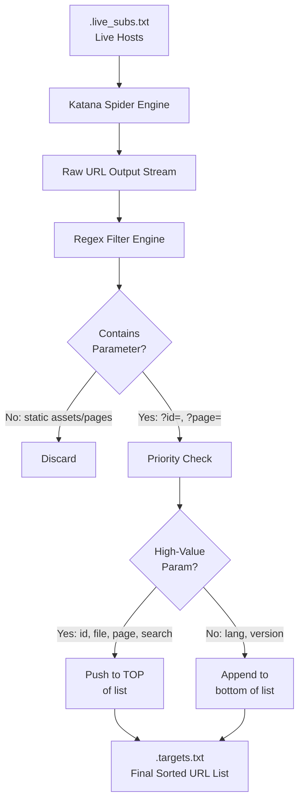
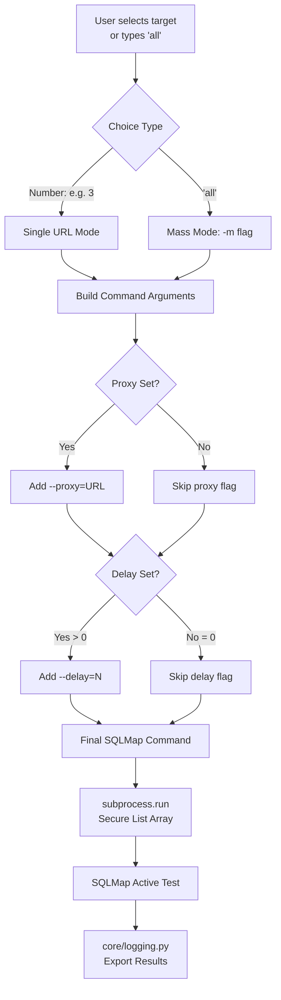
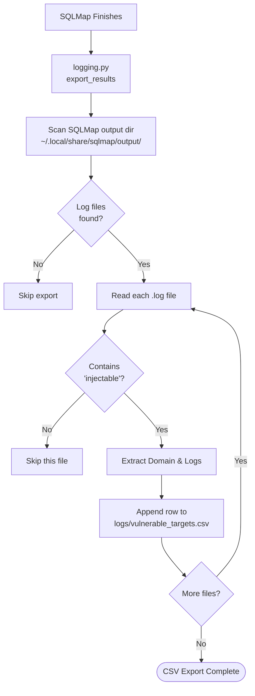
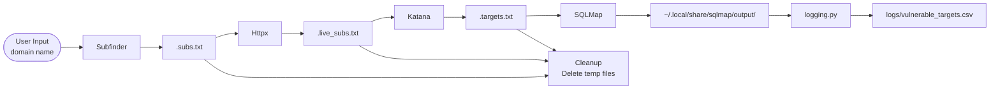
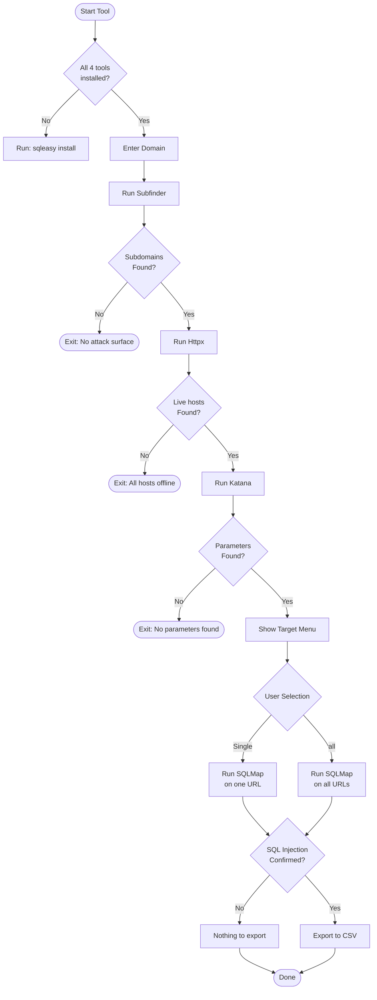
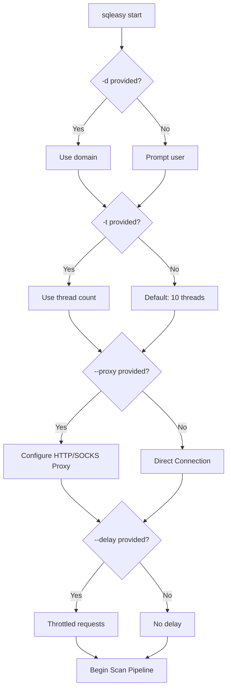

<p align="center">
  
</p>

<h2 align="center">
  SQL Easy — Automated Penetration Testing Framework
</h2>

<p align="center">
  <b>A high-performance automated reconnaissance and SQL injection exploitation orchestration pipeline.</b>
</p>

<p align="center">
  <a href="https://github.com/syed-sameer-ul-hassan/SQL-Easy/actions"></a>
  <a href="LICENSE"></a>
  <a href="https://python.org"></a>
  <a href="https://github.com/syed-sameer-ul-hassan/SQL-Easy/issues"></a>
</p>

---

## Table of Contents

- [Full Pipeline Architecture](#full-pipeline-architecture)
- [Module Breakdown](#module-breakdown)
  - [Module A: Pre-Flight Check](#module-a-dependency-pre-flight-check-coreutilspy)
  - [Module B: Reconnaissance Engine](#module-b-reconnaissance-engine-corereconpy)
  - [Module C: Exploitation Engine](#module-c-exploitation-engine-corescannerpy)
  - [Module D: Automated Logging](#module-d-automated-logging-coreloggingpy)
- [Data Flow Diagram](#data-flow-diagram)
- [Decision Logic Diagram](#decision-logic-diagram)
- [Command Line Reference](#command-line-reference)
- [Stealth & Evasion Modes](#stealth--evasion-modes)
- [File Structure](#file-structure)
- [Installation Deep Dive](#installation-deep-dive)
- [Usage Examples](#usage-examples)
- [Security & Ethics](#security--ethics)
- [FAQ](#faq)

---

## Full Pipeline Architecture

This diagram shows the complete execution flow from start to finish. Every box maps directly to a real module or function inside the SQL Easy codebase.



---

## Module Breakdown

### Module A: Dependency Pre-Flight Check (`core/utils.py`)

Before a single network packet is sent, SQL Easy checks that all four required external tools are active and present in the user's environment.



**Why this matters:** Without this pre-flight check, the pipeline could crash mid-run if an dependency is missing, leaving orphan temporary files containing sensitive scanned hosts.

**Verification mechanism:**
| Tool | Purpose | Verification Logic |
|---|---|---|
| `subfinder` | Passive Subdomain Enumeration | `shutil.which('subfinder')` |
| `httpx` | Active Live Host Probing | `shutil.which('httpx')` |
| `katana` | Active Crawling and Spidering | `shutil.which('katana')` |
| `sqlmap` | Automated SQL Injection Testing | `shutil.which('sqlmap')` |

---

### Module B: Reconnaissance Engine (`core/recon.py`)

This module is the core intelligence funnel. It orchestrates subfinder, httpx, and katana, feeding the raw results into a parameter extraction and sorting logic.

#### Step 1: Subdomain Discovery (Subfinder)



Subfinder passive discovery finds subdomains without directly communicating with the target hosts, relying on public cert transparency logs, search engines, and DNS records.

#### Step 2: Live Port Discovery (Httpx)



Httpx rapidly probes live servers across **5 major ports** (`80`, `443`, `8080`, `8443`, `8000`), filtering out unreachable subdomains before crawling.

#### Step 3: Parameter Crawling & Sorting (Katana)



**Sorting Logic:** Parameters referencing database fields (`?id=`, `?cat=`, `?page=`) are pushed to the top of `.targets.txt`, prioritizing maximum potential success during scan execution.

---

### Module C: Exploitation Engine (`core/scanner.py`)

Takes candidate URLs from `.targets.txt` and hands them off to SQLMap for advanced payload injection testing.



**Always‑on Safety & Stealth Flags:**
- `--batch`: Automated prompt suppression.
- `--random-agent`: Dynamic User-Agent spoofing to avoid WAF signature blocks.
- `--level=1` & `--risk=1`: Safe, conservative scanning profiles.
- `--check-waf`: Active WAF protection detection.

---

### Module D: Automated Logging (`core/logging.py`)

Walks SQLMap output files to identify confirmed vulnerabilities and structures them.



---

## Data Flow Diagram



---

## Decision Logic Diagram



---

## Command Line Reference

The `sqleasy` wrapper supports a wide variety of command arguments:

```bash
sqleasy start [OPTIONS]
```

| Argument | Short | Default | Description |
|---|---|---|---|
| `--domain` | `-d` | Interactive prompt | Target domain to scan |
| `--threads` | `-t` | `10` | Concurrency thread level |
| `--proxy` | — | None | Proxy routing (Burp/Tor) |
| `--delay` | — | `0` | Delay sleep between requests |

### Argument Flow Diagram



---

## Stealth & Evasion Modes

### Stealth Mode (Burp Suite Proxy + Throttling)
```bash
sqleasy start -d target.com --proxy http://127.0.0.1:8080 --delay 3 -t 5
```

### Maximum Speed Bug Bounty Sweep
```bash
sqleasy start -d target.com -t 50
```

### Anonymized Tor Routing
```bash
sqleasy start -d target.com --proxy socks5://127.0.0.1:9050
```

---

## File Structure

```
sql-easy/
│
├── 📄 main.py                   ← Central orchestrator
├── 📄 start.py                  ← Setup backend installer
├── 📄 uninstall.py              ← Dependency cleaner
├── 📄 install.sh                ← Global command symlink installer
├── 📄 sqleasy                   ← Global Python launcher CLI entry point
├── 📄 requirements.txt          ← Minimal python imports
│
├── 📁 core/                     ← Framework source
│   ├── 📄 __init__.py           ← Package marker
│   ├── 📄 config.py             ← CLI argparse configuration
│   ├── 📄 display.py            ← Wifite‑style menu UI
│   ├── 📄 logging.py            ← Log parser and CSV builder
│   ├── 📄 recon.py              ← Subfinder → Httpx → Katana pipeline
│   ├── 📄 scanner.py            ← SQLMap execution engine
│   └── 📄 utils.py              ← Pre-flight check & cleanup
│
├── 📁 assets/
│   └── 📄 logo.svg              ← Branding vector logo
│
├── 📁 logs/                     ← Scanned results directory (Gitignored)
│
├── 📁 .github/                  ← GitHub workflows & templates
│   ├── 📄 PULL_REQUEST_TEMPLATE.md
│   └── 📁 ISSUE_TEMPLATE/
│       ├── 📄 bug_report.md
│       └── 📄 feature_request.md
│
├── 📄 README.md                 ← Document root
└── 📄 TODO.md                   ← Development Roadmap
```

---

## Installation

### Prerequisites

- Python 3.8 or higher
- Git

### Step 1: Clone the Repository

```bash
git clone https://github.com/syed-sameer-ul-hassan/SQL-Easy.git
cd SQL-Easy
```

### Step 2: Install Required Tools

**Linux (Debian/Ubuntu):**
```bash
# Install sqlmap
sudo apt install -y sqlmap unzip wget

# Download and install Subfinder
wget -q https://github.com/projectdiscovery/subfinder/releases/download/v2.6.6/subfinder_2.6.6_linux_amd64.zip -O /tmp/s.zip
unzip -q -o /tmp/s.zip subfinder -d /tmp/
sudo mv /tmp/subfinder /usr/local/bin/
sudo chmod +x /usr/local/bin/subfinder

# Download and install Httpx
wget -q https://github.com/projectdiscovery/httpx/releases/download/v1.6.0/httpx_1.6.0_linux_amd64.zip -O /tmp/h.zip
unzip -q -o /tmp/h.zip httpx -d /tmp/
sudo mv /tmp/httpx /usr/local/bin/
sudo chmod +x /usr/local/bin/httpx

# Download and install Katana
wget -q https://github.com/projectdiscovery/katana/releases/download/v1.1.0/katana_1.1.0_linux_amd64.zip -O /tmp/k.zip
unzip -q -o /tmp/k.zip katana -d /tmp/
sudo mv /tmp/katana /usr/local/bin/
sudo chmod +x /usr/local/bin/katana
```

**macOS:**
```bash
# Install sqlmap
brew install sqlmap

# Download and install Subfinder
wget -q https://github.com/projectdiscovery/subfinder/releases/download/v2.6.6/subfinder_2.6.6_darwin_amd64.zip -O /tmp/s.zip
unzip -q -o /tmp/s.zip subfinder -d /tmp/
sudo mv /tmp/subfinder /usr/local/bin/
sudo chmod +x /usr/local/bin/subfinder

# Download and install Httpx
wget -q https://github.com/projectdiscovery/httpx/releases/download/v1.6.0/httpx_1.6.0_darwin_amd64.zip -O /tmp/h.zip
unzip -q -o /tmp/h.zip httpx -d /tmp/
sudo mv /tmp/httpx /usr/local/bin/
sudo chmod +x /usr/local/bin/httpx

# Download and install Katana
wget -q https://github.com/projectdiscovery/katana/releases/download/v1.1.0/katana_1.1.0_darwin_amd64.zip -O /tmp/k.zip
unzip -q -o /tmp/k.zip katana -d /tmp/
sudo mv /tmp/katana /usr/local/bin/
sudo chmod +x /usr/local/bin/katana
```

**Windows:**
```powershell
# Download and extract tools manually from:
# Subfinder: https://github.com/projectdiscovery/subfinder/releases
# Httpx: https://github.com/projectdiscovery/httpx/releases
# Katana: https://github.com/projectdiscovery/katana/releases
# Sqlmap: https://github.com/sqlmapproject/sqlmap/releases

# Add extracted executables to your system PATH
```


### Step 4: Run the Installer

```bash
chmod +x install.sh
./install.sh
```

This creates the `sqleasy` global command.

---

### After Install — Run From Anywhere

```bash
sqleasy start -d example.com
```
---
## Website
### Visite Website for easy installing methods

[Website](https://sqleasy.orildo.sbs) 

---

## Security & Ethics

> **⚠️ WARNING:** SQL Easy is intended **exclusively** for authorized vulnerability assessments, security research, and academic testing. **Under no circumstances should scans be executed against networks without prior explicit written permission.**

### Safe Engineering Principles
- **No Command Injection:** Subprocess calls avoid `shell=True` and pass lists directly to the OS shell API to prevent shell parameter tampering.
- **Data Leak Safety:** Temporary artifacts are scrubbed from disk on process close, preventing data exposure.
- **Gitignore Protection:** Logs and output directories are locally ignored, keeping target scopes clean from repository commits.

---

## FAQ

**Q: The tool displays a warning: "Required tool subfinder not found".**
*A: Run `sqleasy install` to install all dependencies. If you installed them manually, ensure their paths are fully exported to your system environment variable `$PATH`.*

**Q: How do I update the tool and dependencies?**
*A: Enter the installation path and run `sqleasy update`.*

**Q: Can I run this tool on macOS?**
*A: Yes! Make sure you install Python3 and have `sqlmap`, `subfinder`, `httpx`, and `katana` in your path via Homebrew.*

---

## License

Distributed under the **Apache License 2.0**. See [LICENSE](./LICENSE) for details.
