<p align="center">
  
</p>

<h2 align="center">
  SQL Easy - Automated Penetration Testing Framework
</h2>

<p align="center">
  <b>A high-performance automated reconnaissance and SQL injection exploitation orchestration pipeline.</b>
</p>

<p align="center">
  <a href="https://github.com/syed-sameer-ul-hassan/SQL-Easy/actions"></a>
  <a href="LICENSE"></a>
  <a href="https://python.org"></a>
  <a href="https://github.com/syed-sameer-ul-hassan/SQL-Easy/issues"></a>
</p>

---

## What is SQL Easy?

SQL Easy is a **fully automated SQL injection attack tool** built for security researchers and bug bounty hunters. You give it a domain name — it does everything else.

It automatically:
- Finds all subdomains of the target
- Tests which subdomains are actually online
- Crawls every page looking for URLs with parameters like `?id=1` or `?page=home`
- Passes those URLs to SQLMap, a professional SQL injection scanner
- Saves every confirmed vulnerability to a log file you can read later

You do not need to know how SQL injection works. You do not need to manually run any tools. You just type `sqleasy start -d example.com` and watch it work.

### Who is it for?

- **Bug bounty hunters** who want to scan many targets fast
- **Penetration testers** who want a one-command recon-to-exploit pipeline
- **Security students** who want to learn how automated attacks are structured
- **CTF players** who need a quick injection scanner
- **Termux users** who want to run full security scans from Android (rooted or non-rooted)

### What makes it powerful?

Most people run SQLMap manually on one URL at a time. SQL Easy makes it run across an **entire domain automatically** — finding subdomains, crawling them, filtering the best targets, and running SQLMap on all of them without you doing anything.

In v1.2.0 it also runs **Nuclei** after SQLMap to catch other vulnerability types, uses **Arjun** to discover hidden parameters, and features auto-rotating tamper scripts plus HTML report generation.

---

## Table of Contents

- [What's New in v1.2.0](#whats-new-in-v120)
- [Full Pipeline Architecture](#full-pipeline-architecture)
- [Module Breakdown](#module-breakdown)
  - [Module A: Pre-Flight Check](#module-a-dependency-pre-flight-check-coreutilspy)
  - [Module B: Reconnaissance Engine](#module-b-reconnaissance-engine-corereconpy)
  - [Module C: Exploitation Engine](#module-c-exploitation-engine-corescannerpy)
  - [Module D: Automated Logging](#module-d-automated-logging-coreloggingpy)
- [Data Flow Diagram](#data-flow-diagram)
- [Decision Logic Diagram](#decision-logic-diagram)
- [Command Line Reference](#command-line-reference)
- [Stealth & Evasion Modes](#stealth--evasion-modes)
- [Output & Results](#output--results)
- [File Structure](#file-structure)
- [Installation](#installation)
- [Troubleshooting](#troubleshooting)
- [Security & Ethics](#security--ethics)
- [Tools Used](#tools-used---what-each-one-does)
- [Understanding SQL Injection](#understanding-sql-injection-in-30-seconds)
- [FAQ](#faq)

---

## What's New in v1.2.0

| Feature | Details |
|---|---|
| `--resume` | Skip recon and resume from existing `.targets.txt` |
| `--target-list` | Batch scan multiple domains from a file |
| `--tamper` | Auto-rotating tamper script pool (space2comment, between, randomcase, etc.) |
| `--config` | Load default flags from `config.yaml` |
| `--html` | Generate dark-themed HTML report after scan |
| TOR detection | Warns if TOR is running but `--proxy` is not set |
| Randomized ordering | Shuffles high/normal priority URLs to defeat pattern detection |
| Gowitness | Auto-screenshots confirmed vulnerable pages after scan |
| Per-tool install | Each tool asks `[y/n]` with description of what it does |
| Termux support | Full Android compatibility — no root, no sudo, arch-aware binaries |
| Docker image | Zero-dependency deployment via `Dockerfile` |
| Unit tests | `pytest` coverage for all `core/` modules |

---

## How It Works (Simple Version)

Here is the entire process explained in plain English, step by step:

**Step 1 — You give it a domain:**
You type `sqleasy start -d example.com`. The tool validates the domain and then begins.

**Step 2 — It finds all subdomains:**
Using a tool called Subfinder, it silently searches public DNS records, certificate transparency logs, and search engines to find every subdomain of your target — like `api.example.com`, `shop.example.com`, `admin.example.com`.

**Step 3 — It checks which ones are alive:**
Not all subdomains have live web servers. Httpx quickly knocks on the door of each one across 5 common ports. Only the ones that respond get passed forward.

**Step 4 — It discovers hidden parameters:**
Arjun (if installed) probes live hosts with a large wordlist, looking for GET/POST parameters the site accepts but does not advertise. These hidden parameters are prime injection targets.

**Step 5 — It collects historical URLs:**
GAU or Waybackurls (if installed) pull years of archived URLs from the Wayback Machine and other sources. Old endpoints often still work and are rarely protected.

**Step 6 — It crawls every page:**
Katana spiders every live host, following links and forms, collecting every URL that contains a parameter like `?id=1`. These are the injection candidates.

**Step 7 — It filters the best targets:**
The smart URL filter removes static files (CSS, JS, fonts, images) and cache-buster-only params. It then ranks the remaining URLs — parameters like `?id=`, `?user=`, `?action=` go to the top because they are historically the most injectable.

**Step 8 — You choose what to scan:**
SQL Easy shows you the top 50 targets in a numbered menu. You pick one number, or type `all` to scan everything.

**Step 9 — SQLMap runs automatically:**
SQLMap tests each URL for SQL injection using advanced payloads. It checks `--level=3 --risk=2` by default, meaning it tests deeply — headers, cookies, forms, and parameters. WAF evasion (`--tamper=space2comment`) is applied automatically.

**Step 10 — Nuclei scans for other vulnerabilities:**
After SQLMap finishes, Nuclei scans all live hosts for other high-impact vulnerabilities at medium/high/critical severity.

**Step 11 — Results are saved:**
Every confirmed injection is saved to `logs/vulnerable_targets.csv` and `logs/vulnerable_targets.json`. You can view them any time with `sqleasy logs` or `sqleasy report`.

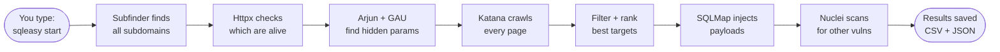

---

## Quick Start

### Install

Visit **[sqleasy.orildo.sbs](https://sqleasy.orildo.sbs)** for platform-specific installation instructions.

**Bug reports:** [bug.orildo.sbs](https://bug.orildo.sbs)

### Run your first scan

```bash
sqleasy start -d example.com
```

### See your results

```bash
sqleasy report
```

### Delete all saved data

```bash
sqleasy clear
```

### What you see while it runs

```
[*] Checking required backend tools...
[+] Ready   : subfinder
[+] Ready   : httpx
[+] Ready   : katana
[+] Ready   : sqlmap

[>] Enter target domain: example.com

[*] Starting subdomain enumeration...
api.example.com
shop.example.com
admin.example.com

[*] Probing live hosts...
https://api.example.com
https://shop.example.com

[*] Running Arjun on live hosts...
[+] Found: https://api.example.com?user_id=1

[*] Crawling URLs...
 Crawled: 47 URLs | Parameters found: 12

[+] Recon complete: 12 raw param URL(s) -> 12 injectable candidate(s) queued.

 +----------------------------------------------------------+
 |  AVAILABLE PARAMETER TARGETS (12 found)                 |
 +----------------------------------------------------------+

 1     https://shop.example.com/product.php?id=1
 2     https://api.example.com?user_id=1
 3     https://admin.example.com/index.php?page=home
 ...

[>] Select target number or type 'all': all

[*] Handing targets off to SQLMap...
...
[+] VULNERABLE: https://shop.example.com/product.php?id=1

[+] Scan complete in 4m 32s
[+] Results saved to logs/vulnerable_targets.csv
[+] Results saved to logs/vulnerable_targets.json
```

---

## Full Pipeline Architecture

This diagram shows the complete v1.2.0 execution flow. Every box maps directly to a real module or function inside the codebase.

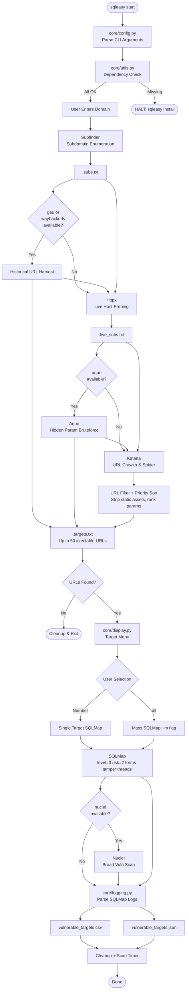

---

## Module Breakdown

### Module A: Dependency Pre-Flight Check (`core/utils.py`)

Before a single network packet is sent, SQL Easy checks that all four required external tools are active and present in the user's environment.


**Why this matters:** Without this pre-flight check, the pipeline could crash mid-run if an dependency is missing, leaving orphan temporary files containing sensitive scanned hosts.

**Verification mechanism:**
| Tool | Required | Purpose | Check |
|---|---|---|---|
| `subfinder` | Yes | Passive subdomain enumeration | `shutil.which('subfinder')` |
| `httpx` | Yes | Live host probing | `shutil.which('httpx')` |
| `katana` | Yes | URL crawling and spidering | `shutil.which('katana')` |
| `sqlmap` | Yes | SQL injection testing | `shutil.which('sqlmap')` |
| `nuclei` | Optional | Broad vulnerability scan | `shutil.which('nuclei')` |
| `arjun` | Optional | Hidden parameter discovery | `shutil.which('arjun')` |
| `gau` / `waybackurls` | Optional | Historical URL harvest | `shutil.which('gau')` |

---

### Module B: Reconnaissance Engine (`core/recon.py`)

This module is the core intelligence funnel. It orchestrates subfinder, httpx, and katana, feeding the raw results into a parameter extraction and sorting logic.

#### Step 1: Subdomain Discovery (Subfinder)

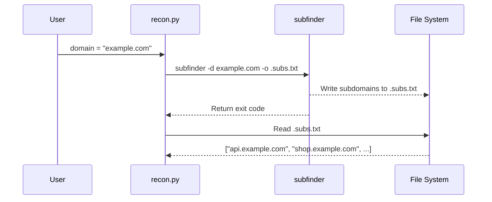

Subfinder passive discovery finds subdomains without directly communicating with the target hosts, relying on public cert transparency logs, search engines, and DNS records.

#### Step 2: Live Port Discovery (Httpx)

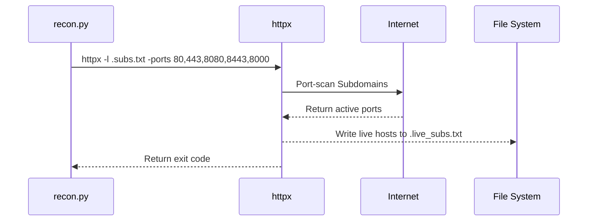

Httpx rapidly probes live servers across **5 major ports** (`80`, `443`, `8080`, `8443`, `8000`), filtering out unreachable subdomains before crawling.

#### Step 3: Arjun - Hidden Parameter Discovery

If `arjun` is installed, it runs on up to 5 live hosts before Katana, bruteforcing hidden GET/POST parameters that are not visible in page source.

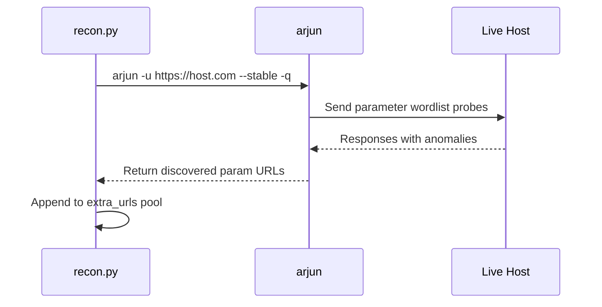

#### Step 4: Historical URL Harvest - GAU / Waybackurls

If `gau` or `waybackurls` is installed, years of archived URLs are harvested before Katana runs.

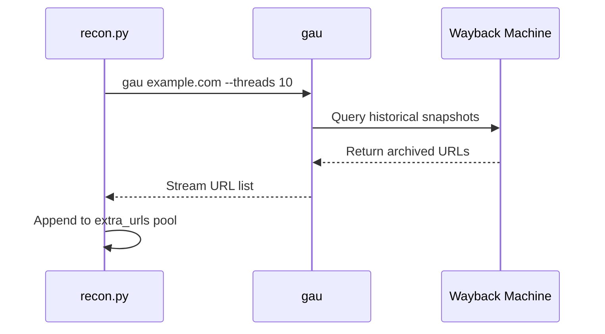

#### Step 5: Parameter Crawling, Filtering & Sorting (Katana)

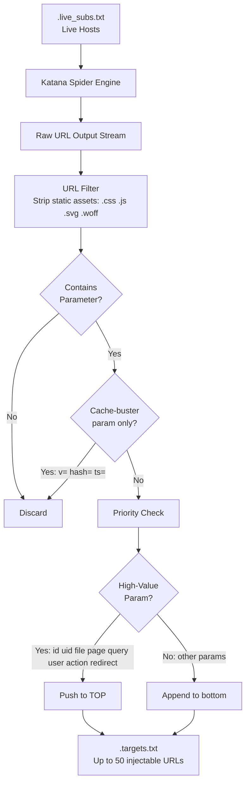

**Sorting Logic:** Parameters referencing database fields (`?id=`, `?uid=`, `?page=`, `?action=`, `?redirect=`) are pushed to the top. Static assets and cache-buster-only URLs are discarded entirely.

---

### Module C: Exploitation Engine (`core/scanner.py`)

Takes candidate URLs from `.targets.txt`, applies auto-rotating tamper scripts for WAF evasion, and hands them off to SQLMap for advanced payload injection testing. If `gowitness` is installed, screenshots confirmed vulnerable pages.

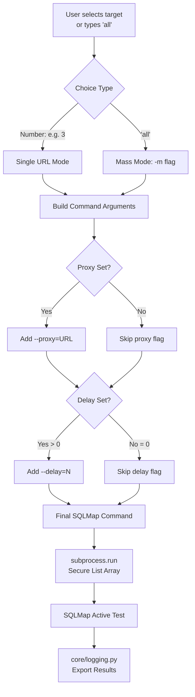

**Default SQLMap Flags:**
| Flag | Value | Purpose |
|---|---|---|
| `--batch` | always | Suppress all interactive prompts |
| `--random-agent` | always | Rotate User-Agent to avoid WAF blocks |
| `--level` | 3 (default) | Test depth: headers, cookies, forms |
| `--risk` | 2 (default) | Risk tolerance: includes heavier payloads |
| `--forms` | always | Also test HTML forms on each target |
| `--threads` | 5 | Concurrent injection threads |
| `--tamper` | auto-rotation | Random 2-script pool from space2comment/between/randomcase/charencode/equaltolike |
| `--timeout` | 10s | Per-request timeout |
| `--retries` | 2 | Auto-retry on connection failure |

**Post-scan Nuclei sweep:**
After SQLMap completes, if `nuclei` is installed it runs a broad vulnerability scan across all confirmed live hosts at medium/high/critical severity.

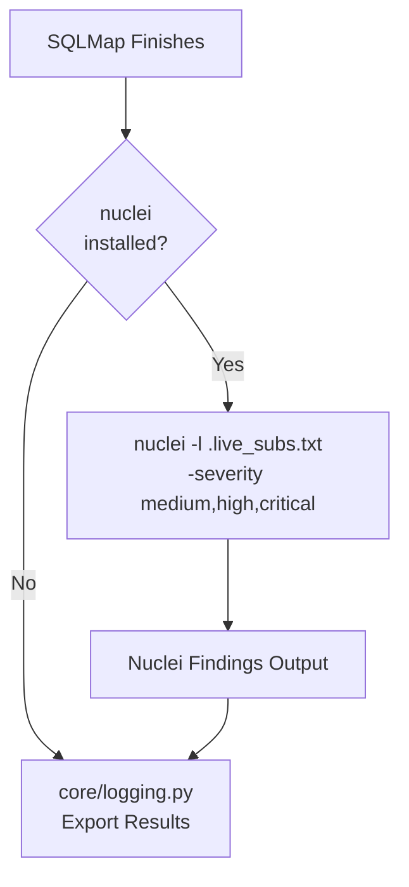

**Gowitness screenshot (v1.2.0):**
If `gowitness` is installed, SQL Easy captures screenshots of confirmed vulnerable targets after the scan completes.

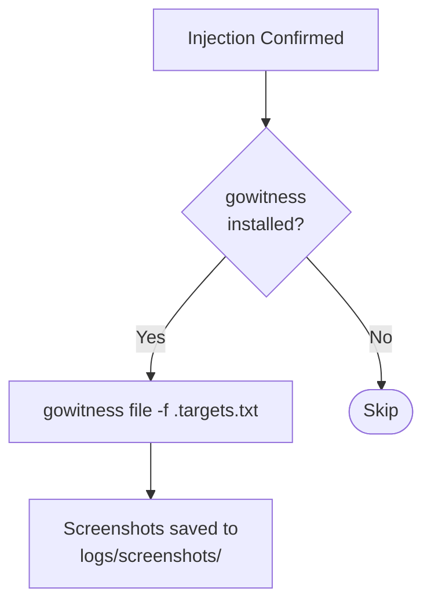

---

### Module D: Automated Logging (`core/logging.py`)

Walks SQLMap output files to identify confirmed vulnerabilities and structures them into CSV, JSON, and optionally a styled HTML report.

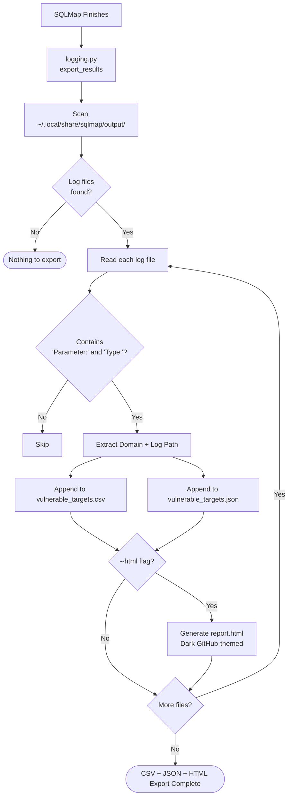

**Output files written after every scan:**
| File | Format | Contents |
|---|---|---|
| `logs/vulnerable_targets.csv` | CSV | Domain, log file path |
| `logs/vulnerable_targets.json` | JSON | Domain, log path, timestamp |
| `logs/report.html` | HTML | Dark-themed summary with stats table (v1.2.0) |
| `logs/screenshots/` | PNG | Gowitness captures of vulnerable pages (v1.2.0) |

---

## Data Flow Diagram

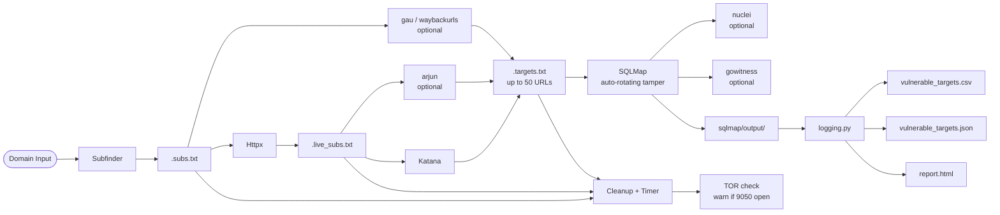

---

## Decision Logic Diagram

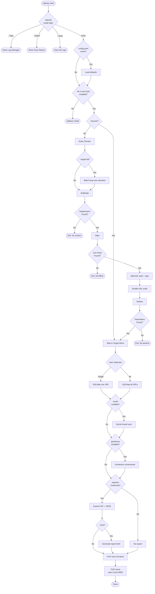

---

## Command Line Reference

### sqleasy Commands

| Command | Description |
|---|---|
| `sqleasy start` | Launch interactive scan pipeline |
| `sqleasy start -d <domain>` | Launch scan directly for a domain |
| `sqleasy start --target-list <file>` | Batch scan multiple domains |
| `sqleasy start --resume` | Resume from existing `.targets.txt` |
| `sqleasy start --html` | Generate HTML report after scan |
| `sqleasy logs` | Open log manager (view / delete previous results) |
| `sqleasy report` | Show full scan report summary (CSV + JSON + HTML) |
| `sqleasy clear` | Wipe all logs and temp files |
| `sqleasy version` | Show version info and full pipeline summary |
| `sqleasy install` | Install all required backend tools |
| `sqleasy uninstall` | Remove all installed tools and config |
| `sqleasy update` | Pull latest version from GitHub |

### Scan Flags (`sqleasy start [OPTIONS]`)

| Flag | Short | Default | Description |
|---|---|---|---|
| `--domain` | `-d` | Prompt | Target domain |
| `--threads` | `-t` | `10` | Concurrency threads |
| `--proxy` | - | None | HTTP/SOCKS5 proxy URL |
| `--delay` | - | `0` | Seconds between requests |
| `--level` | - | `3` | SQLMap test level (1-5) |
| `--risk` | - | `2` | SQLMap risk level (1-3) |
| `--tables` | - | off | Also enumerate database tables |
| `--dump` | - | off | Dump full table contents |
| `--tamper` | - | auto | SQLMap tamper scripts (comma-separated) |
| `--resume` | - | off | Skip recon, resume from `.targets.txt` |
| `--target-list` | - | None | File with one domain per line (batch) |
| `--config` | - | None | Load defaults from `config.yaml` |
| `--html` | - | off | Generate HTML report after scan |
| `--logs` | - | off | Enter log manager (no scan) |
| `--report` | - | off | Show report (no scan) |
| `--clear` | - | off | Clear all logs (no scan) |

### Argument Flow Diagram

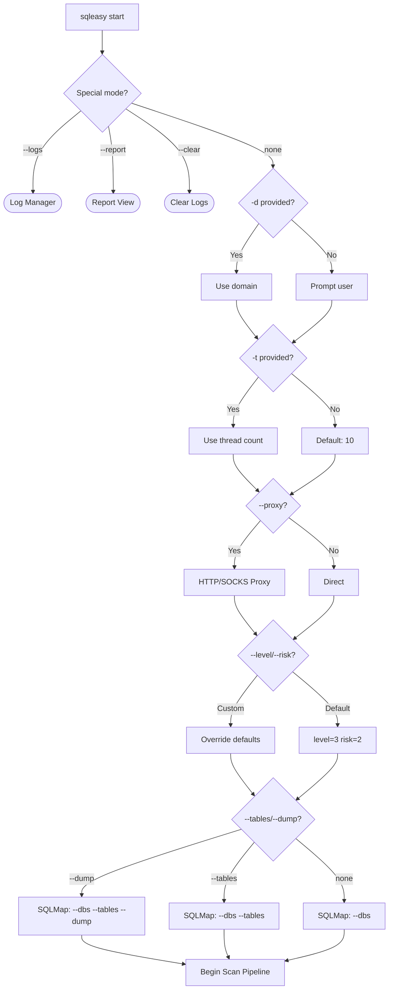

---

## Stealth & Evasion Modes

### Stealth Mode (Burp Suite Proxy + Throttling)
```bash
sqleasy start -d target.com --proxy http://127.0.0.1:8080 --delay 3 -t 5
```

### Maximum Speed Bug Bounty Sweep
```bash
sqleasy start -d target.com -t 50
```

### Anonymized Tor Routing
```bash
sqleasy start -d target.com --proxy socks5://127.0.0.1:9050
```

### Deep Extraction Mode
```bash
sqleasy start -d target.com --level 5 --risk 3 --dump
```

### Table Enumeration Only
```bash
sqleasy start -d target.com --tables
```

### Log Management
```bash
sqleasy logs      # view previous results
sqleasy report    # full report summary
sqleasy clear     # wipe all scan data
```

---

## Output & Results

SQL Easy saves results in two formats after every scan. Both files are in the `logs/` directory.

### logs/vulnerable_targets.csv

A standard CSV file you can open in any spreadsheet editor.

```
domain,log_file
shop.example.com,/home/user/.local/share/sqlmap/output/shop.example.com/log
admin.example.com,/home/user/.local/share/sqlmap/output/admin.example.com/log
```

### logs/vulnerable_targets.json

A machine-readable JSON file you can import into other tools or scripts.

```json
[
  {
    "domain": "shop.example.com",
    "log_file": "/home/user/.local/share/sqlmap/output/shop.example.com/log",
    "timestamp": "2026-05-25T06:30:00"
  }
]
```

### Reading results with sqleasy

```bash
sqleasy logs      # opens log manager - see all past scans
sqleasy report    # shows a full summary table in terminal
sqleasy clear     # deletes everything when you are done
```

### Full SQLMap output

SQL Easy does not delete the raw SQLMap output. The full injection details, parameter names, payloads, and database names are always in:
```
~/.local/share/sqlmap/output/<domain>/
```

This includes every payload that worked, the type of injection (boolean-based, time-based, UNION), and the full list of databases found.

---

## File Structure

```
sql-easy/
|
+-- main.py                   <- Central orchestrator (config, resume, batch, html)
+-- start.py                  <- Setup backend installer (Termux-aware)
+-- uninstall.py              <- Dependency cleaner (Termux-aware)
+-- install.sh                <- Linux/macOS/Termux installer (per-tool prompts)
+-- install.ps1               <- Windows PowerShell installer (per-tool prompts)
+-- sqleasy                   <- Global Python launcher CLI entry point
+-- requirements.txt          <- Minimal python imports
+-- config.yaml.example       <- Default flags template for per-project configs
+-- Dockerfile                <- Zero-dependency container image
|
+-- core/                     <- Framework source
|   +-- __init__.py           <- Package marker
|   +-- config.py             <- CLI argparse + config.yaml defaults
|   +-- display.py            <- Wifite-style menu UI
|   +-- logging.py            <- CSV / JSON / HTML exporter + report viewer
|   +-- recon.py              <- Subfinder -> Httpx -> Arjun -> Katana pipeline
|   +-- scanner.py            <- SQLMap executor with tamper rotation + gowitness
|   +-- utils.py              <- Pre-flight check, cleanup, config loader
|
+-- tests/                    <- pytest unit tests (all core modules)
|   +-- test_config.py
|   +-- test_utils.py
|   +-- test_recon.py
|   +-- test_scanner.py
|   +-- test_logging.py
|
+-- assets/
|   +-- logo.svg              <- Branding vector logo
|
+-- logs/                     <- Scanned results directory (Gitignored)
|   +-- screenshots/          <- Gowitness captures (Gitignored)
|
+-- .github/                  <- GitHub workflows & templates
|   +-- PULL_REQUEST_TEMPLATE.md
|   +-- ISSUE_TEMPLATE/
|       +-- bug_report.md
|       +-- feature_request.md
|
+-- README.md                 <- Document root
+-- TODO.md                   <- Development Roadmap
```

---

## Installation

> **Recommended:** Use the one-line installer above — it handles cloning and setup automatically.
> The manual steps below are only needed if you want to clone to a custom location.

### Prerequisites

- Python 3.8 or higher
- Git

### Step 1: Clone the Repository

```bash
git clone https://github.com/syed-sameer-ul-hassan/SQL-Easy.git
cd SQL-Easy
```

### Step 2: Install Required Tools

**Linux (Debian/Ubuntu):**
```bash
# Install sqlmap
sudo apt install -y sqlmap unzip wget

# Download and install Subfinder
wget -q https://github.com/projectdiscovery/subfinder/releases/download/v2.6.6/subfinder_2.6.6_linux_amd64.zip -O /tmp/s.zip
unzip -q -o /tmp/s.zip subfinder -d /tmp/
sudo mv /tmp/subfinder /usr/local/bin/
sudo chmod +x /usr/local/bin/subfinder

# Download and install Httpx
wget -q https://github.com/projectdiscovery/httpx/releases/download/v1.6.0/httpx_1.6.0_linux_amd64.zip -O /tmp/h.zip
unzip -q -o /tmp/h.zip httpx -d /tmp/
sudo mv /tmp/httpx /usr/local/bin/
sudo chmod +x /usr/local/bin/httpx

# Download and install Katana
wget -q https://github.com/projectdiscovery/katana/releases/download/v1.1.0/katana_1.1.0_linux_amd64.zip -O /tmp/k.zip
unzip -q -o /tmp/k.zip katana -d /tmp/
sudo mv /tmp/katana /usr/local/bin/
sudo chmod +x /usr/local/bin/katana
```

**macOS:**
```bash
# Install sqlmap
brew install sqlmap

# Download and install Subfinder
wget -q https://github.com/projectdiscovery/subfinder/releases/download/v2.6.6/subfinder_2.6.6_darwin_amd64.zip -O /tmp/s.zip
unzip -q -o /tmp/s.zip subfinder -d /tmp/
sudo mv /tmp/subfinder /usr/local/bin/
sudo chmod +x /usr/local/bin/subfinder

# Download and install Httpx
wget -q https://github.com/projectdiscovery/httpx/releases/download/v1.6.0/httpx_1.6.0_darwin_amd64.zip -O /tmp/h.zip
unzip -q -o /tmp/h.zip httpx -d /tmp/
sudo mv /tmp/httpx /usr/local/bin/
sudo chmod +x /usr/local/bin/httpx

# Download and install Katana
wget -q https://github.com/projectdiscovery/katana/releases/download/v1.1.0/katana_1.1.0_darwin_amd64.zip -O /tmp/k.zip
unzip -q -o /tmp/k.zip katana -d /tmp/
sudo mv /tmp/katana /usr/local/bin/
sudo chmod +x /usr/local/bin/katana
```

**Windows:**
```powershell
# Download and extract tools manually from:
# Subfinder: https://github.com/projectdiscovery/subfinder/releases
# Httpx: https://github.com/projectdiscovery/httpx/releases
# Katana: https://github.com/projectdiscovery/katana/releases
# Sqlmap: https://github.com/sqlmapproject/sqlmap/releases

# Add extracted executables to your system PATH
```

**Termux (Android):**
```bash
# Install prerequisites (no root needed)
pkg install python wget unzip git

# Clone and install
git clone https://github.com/syed-sameer-ul-hassan/SQL-Easy.git
cd SQL-Easy
bash install.sh
```
> **Note:** Termux installs tools to `$PREFIX/bin` without `sudo`. Works on both rooted and non-rooted devices.


### Step 4: Run the Installer

```bash
chmod +x install.sh
./install.sh
```

This creates the `sqleasy` global command.

---

### After Install - Run From Anywhere

```bash
sqleasy start -d example.com
```
---
## Website
### Visite Website for easy installing methods

[Website](https://sqleasy.orildo.sbs) 

---

## Troubleshooting

### Tool not found after install

If you see `[!] Missing: subfinder` after running `sqleasy install`, the binary was not added to your PATH.

```bash
export PATH=$PATH:/usr/local/bin
source ~/.bashrc
```

Or re-run the installer:
```bash
sqleasy install
```

### SQLMap finds no injection

This is normal for well-protected targets. Try increasing depth:
```bash
sqleasy start -d example.com --level 5 --risk 3
```

Or route through Burp to see what is being sent:
```bash
sqleasy start -d example.com --proxy http://127.0.0.1:8080
```

### No URLs found after crawling

The target may have very few parameterized pages. Try using GAU for historical URLs:
```bash
# Make sure gau is installed
sqleasy install
sqleasy start -d example.com
```

Or try Arjun for hidden parameters — it finds endpoints that crawlers miss entirely.

### Tool runs too slow

Increase threads for faster scanning:
```bash
sqleasy start -d example.com -t 50
```

### Blocked by WAF

Route through Tor and add a delay:
```bash
sqleasy start -d example.com --proxy socks5://127.0.0.1:9050 --delay 2
```

### Scan interrupted midway

Temporary files are cleaned up automatically on exit. Simply run again:
```bash
sqleasy start -d example.com
```

### Logs are cluttered from old scans

```bash
sqleasy clear
```

---

## Security & Ethics

> **WARNING:** SQL Easy is intended **exclusively** for authorized vulnerability assessments, security research, and academic testing. **Under no circumstances should scans be executed against networks without prior explicit written permission.**

### Safe Engineering Principles
- **No Command Injection:** Subprocess calls avoid `shell=True` and pass lists directly to the OS shell API to prevent shell parameter tampering.
- **Data Leak Safety:** Temporary artifacts are scrubbed from disk on process close, preventing data exposure.
- **Gitignore Protection:** Logs and output directories are locally ignored, keeping target scopes clean from repository commits.

---

## Tools Used - What Each One Does

SQL Easy is a pipeline that connects several best-in-class open source tools. Here is a plain-English description of what each one does and why it is used:

| Tool | Made By | What it does in simple terms |
|---|---|---|
| `subfinder` | ProjectDiscovery | Searches the internet for all subdomains of a domain without touching the target directly. Uses public sources like cert logs, DNS databases, and search engines. |
| `httpx` | ProjectDiscovery | Takes a list of domains and quickly checks which ones have active web servers. Like knocking on every door to see who answers. |
| `katana` | ProjectDiscovery | A fast web crawler. Visits each live host, follows every link, and collects all URLs it finds that have query parameters. |
| `sqlmap` | sqlmapproject | The core injection engine. Takes a URL like `?id=1` and automatically tests hundreds of SQL injection payloads to see if the database leaks data. |
| `nuclei` | ProjectDiscovery | A template-based vulnerability scanner. After SQLMap finishes, it scans live hosts for hundreds of other known vulnerabilities beyond just SQL injection. |
| `arjun` | s0md3v | A hidden parameter discovery tool. Sends probes to web endpoints to find GET/POST parameters that are not visible in the HTML but are accepted by the server. |
| `gau` | lc | Gets all known URLs for a domain from the Wayback Machine, Common Crawl, and other archives. Finds old endpoints that are often still alive and unprotected. |

---

## Understanding SQL Injection in 30 Seconds

A SQL injection vulnerability happens when a website puts your input directly into a database query without sanitizing it.

For example, when you visit `https://example.com/product.php?id=1`, the server runs:
```sql
SELECT * FROM products WHERE id = 1
```

If the server does not sanitize the input, you can change `1` to `1 OR 1=1` and the query becomes:
```sql
SELECT * FROM products WHERE id = 1 OR 1=1
```

This returns every row in the database. From there, an attacker can dump usernames, passwords, emails, credit cards — anything in the database.

SQL Easy finds these vulnerable endpoints automatically and proves the injection works — it does not guess. SQLMap confirms the injection with real payloads before logging anything as vulnerable.

---

## FAQ

**Q: Where do I report a bug?**
*A: Use the dedicated bug reporting portal at [bug.orildo.sbs](https://bug.orildo.sbs) or open a GitHub Issue using the bug report template.*

**Q: The tool displays a warning: "Required tool subfinder not found".**
*A: Run `sqleasy install` to install all dependencies. If you installed them manually, ensure their paths are fully exported to your system environment variable `$PATH`.*

**Q: How do I update the tool and dependencies?**
*A: Run `sqleasy update` from anywhere. It will pull the latest version from GitHub automatically.*

**Q: Can I run this tool on macOS?**
*A: Yes. Run the same install.sh script — it auto-detects macOS and uses Homebrew instead of apt.*

**Q: Can I run this tool on Windows?**
*A: Yes, via PowerShell: `irm https://raw.githubusercontent.com/syed-sameer-ul-hassan/SQL-Easy/main/install.ps1 | iex`*

**Q: What is the difference between --tables and --dump?**
*A: `--tables` lists the database names and table names. `--dump` goes further and dumps the actual row data from those tables. Start with `--tables` first to see what is there, then use `--dump` if you need the contents.*

**Q: What does --level and --risk do?**
*A: `--level` (1-5) controls how many injection points SQLMap tests. Higher = slower but finds more. `--risk` (1-3) controls how aggressive the payloads are. Higher = more destructive payloads. Default is level=3 risk=2 which is a good balance.*

**Q: Why does it use --tamper=space2comment?**
*A: Many WAFs (Web Application Firewalls) block SQL keywords like `SELECT` or `UNION`. The space2comment tamper replaces spaces with SQL comments (`/**/`) which many WAFs do not detect. It is a basic but effective evasion technique.*

**Q: Is Nuclei, Arjun, and GAU required?**
*A: No. They are all optional. If they are not installed, SQL Easy skips those steps silently and continues with the core pipeline. Run `sqleasy install` to get everything.*

**Q: Where are the raw SQLMap logs stored?**
*A: At `~/.local/share/sqlmap/output/<domain>/`. SQL Easy never deletes these. They contain the full payload details, injection type, and database contents.*

**Q: How do I completely remove SQL Easy?**
*A: Run `sqleasy uninstall`. It removes all binaries, the config directory, and optionally removes sqlmap.*

---

## License

Distributed under the **Apache License 2.0**. See [LICENSE](./LICENSE) for details.

---

## Credits

SQL Easy is built on top of several outstanding open source projects. Without these tools, this pipeline would not be possible.

| Project | Author / Org | Link |
|---|---|---|
| SQLMap | sqlmapproject | https://github.com/sqlmapproject/sqlmap |
| Subfinder | ProjectDiscovery | https://github.com/projectdiscovery/subfinder |
| Httpx | ProjectDiscovery | https://github.com/projectdiscovery/httpx |
| Katana | ProjectDiscovery | https://github.com/projectdiscovery/katana |
| Nuclei | ProjectDiscovery | https://github.com/projectdiscovery/nuclei |
| Arjun | s0md3v | https://github.com/s0md3v/Arjun |
| GAU | lc | https://github.com/lc/gau |

---

*SQL Easy v1.2.0 - Released 2026-05-27 - [Apache 2.0 License](./LICENSE)*
